<div align="center">

<picture>
  <source media="(prefers-color-scheme: dark)" srcset="assets/dark.svg">
  <source media="(prefers-color-scheme: light)" srcset="assets/light.svg">
  
</picture>

<br/>


<br/>

[](https://fizeeeti0n.vercel.app/)
[](https://linkedin.com/in/fiizeeeti0n)
[](mailto:ahanaf.shahriar.nafiz@gmail.com)
[](https://github.com/fizeeeti0n)

<br/>

</div>

---

## ◈ About

```typescript
const engineer = {
  name       : "Ahanaf Shahriar Nafiz",
  role       : "Frontend Developer & AI Application Builder",
  university : "University of Asia Pacific — B.Sc. CSE (Expected 2027)",
  location   : "Dhaka, Bangladesh",
  focus      : ["LLM Integration", "React.js", "Production-Grade Frontends"],
  building   : "AI-powered tools that solve real student and professional problems",
  philosophy : "Ship fast. Iterate with purpose. Build for humans.",
};
```

I engineer responsive, production-ready web applications that sit at the intersection of frontend excellence and applied artificial intelligence. My work spans from architecting component-driven React systems optimized for performance to integrating large language model APIs — Gemini and OpenAI — into workflows that deliver measurable user value.

I operate with a product engineering mindset: every interface decision is a UX decision, and every API call is a cost-versus-value tradeoff. Having worked at 10 Minute School on real-growth campaigns and automated AI-driven pipelines, I bring both engineering discipline and product intuition to what I build.

**Open To:** Frontend Engineering Roles · AI/ML Product Engineering · Full Stack Internships · Open Source Collaboration · Research Partnerships

---

## ◈ Tech Stack

<div align="center">

**Languages**

[](https://skillicons.dev)

**Frontend**

[](https://skillicons.dev)

**Backend **

[](https://skillicons.dev)

**Cloud, DevOps & Tooling**

[](https://skillicons.dev)

</div>

---

## ◈ AI / ML Expertise

<div align="center">

| Domain | Proficiency | Details |
|---|---|---|
| LLM API Integration | ███████░░ Proficient | Gemini API, OpenAI API — production-level prompt workflows |
| Prompt Engineering | █████████░ Advanced | Context chaining, ATS optimization, relevance tuning |
| NLP Concepts | ████████░░ Proficient | Keyword extraction, document Q&A, semantic matching |
| AI Workflow Automation | ██████████ Advanced | Automated posting systems, analytics pipelines |
| Frontend AI UX | ██████████ Advanced| Latency-optimized AI interfaces, async response rendering |

</div>

---

## ◈ Featured Projects

<details>
<summary><strong>🔷 UniStudy AI — AI-Powered Student Assistant</strong></summary>

<br/>

> An intelligent study companion that allows students to interrogate any PDF document with natural language questions — powered by Gemini API with optimized prompt workflows for accuracy and speed.

| Attribute | Details |
|---|---|
| **Stack** | HTML5, CSS3, JavaScript (ES6+), Gemini API |
| **Scale** | Single-page application, client-side architecture |
| **Performance** | 25% reduction in API latency through prompt pipeline optimization |
| **AI Accuracy** | ~15% improvement in response relevance via engineered context prompts |
| **Impact** | Enables students to ask unlimited questions grounded in their own PDF content |


UniStudy AI addresses a core problem in student workflows: the inability to efficiently extract answers from long-form academic documents. Rather than searching manually, users upload their PDF and query it conversationally. The system uses carefully engineered prompts to ground Gemini's responses exclusively in the uploaded document's context, significantly reducing hallucination and improving answer precision for academic use cases.

</details>

<details>
<summary><strong>🔷 ApexApply AI — Smart Job Application Strategist</strong></summary>

<br/>

> A career intelligence tool that scores CVs against job descriptions using NLP-based ATS analysis, generates custom cover letters, and surfaces keyword optimization recommendations to maximize application success rates.

| Attribute | Details |
|---|---|
| **Stack** | JavaScript (ES6+), Gemini API, Prompt Engineering |
| **Scale** | Browser-based tool, zero backend dependencies |
| **Performance** | Real-time scoring and generation with streaming-optimized prompt design |
| **NLP Techniques** | ATS keyword matching, semantic gap analysis, density scoring |
| **Impact** | Reduces manual CV-to-JD alignment effort, increases ATS pass-through likelihood |


ApexApply AI bridges the gap between a candidate's existing CV and what a specific job description demands. The system parses both the CV and JD, runs NLP-based keyword density and semantic relevance analysis, computes an ATS compatibility score, and generates a tailored cover letter calibrated to the role. This represents a practical application of prompt chaining and structured output engineering using Gemini's API — delivering recruiter-level feedback at zero marginal cost.

</details>

<details>
<summary><strong>🔷 TEDx Clone — React-Based Responsive Platform</strong></summary>

<br/>

> A high-fidelity, component-driven recreation of the TEDx web platform built in React.js and Tailwind CSS, optimized for scalability, code reuse, and deployment on Vercel.

| Attribute | Details |
|---|---|
| **Stack** | React.js, Tailwind CSS, Vercel |
| **Scale** | Multi-section SPA with reusable component library |
| **Performance** | 30% reduction in code redundancy via component-driven architecture |
| **Deployment** | Production deployment on Vercel with CI/CD integration |
| **Impact** | Demonstrated mastery of React component patterns and responsive design systems |
This project was an architectural exercise in translating a complex, content-heavy platform into a modular React codebase. Component abstraction was prioritized to eliminate repetition across sections, producing a clean and maintainable structure deployable to production. Tailwind CSS was used to enforce a consistent design system without custom stylesheet overhead.

</details>


<div align="center">

<picture>
  <source media="(prefers-color-scheme: dark)" srcset="https://raw.githubusercontent.com/fizeeeti0n/fizeeeti0n/output/github-contribution-grid-snake-dark.svg" />
  <source media="(prefers-color-scheme: light)" srcset="https://raw.githubusercontent.com/fizeeeti0n/fizeeeti0n/output/github-contribution-grid-snake.svg" />
  
</picture>

</div>

---

## ◈ Current Focus

```yaml
current_focus:
  learning:
    - Advanced React patterns (Server Components, Suspense architecture)
    - TypeScript for large-scale frontend systems
    - RAG pipelines and vector embeddings for document AI

  building:
    - AI-powered tools targeting student productivity workflows
    - LLM-integrated full stack applications with Django + React
    - Open source frontend utilities with real-world utility

  exploring:
    - Agent-based AI systems and multi-step reasoning
    - Cloud-native deployment patterns on GCP
    - Performance budgeting and Core Web Vitals optimization

  open_to:
    - Frontend Engineering Internships
    - AI/ML Product Engineering Roles
    - Full Stack Development Opportunities
    - Open Source Collaboration
    - Research Partnerships in Applied AI
```

---

## ◈ Connect

<div align="center">

[](mailto:ahanaf.shahriar.nafiz@gmail.com)
[](https://linkedin.com/in/fizeeeti0n)
[](https://github.com/fizeeeti0n)
[](https://fizeeeti0n.vercel.app/)

</div>

---

<div align="center">

*"The best interfaces are invisible — the engineering behind them, unforgettable."*


</div>
